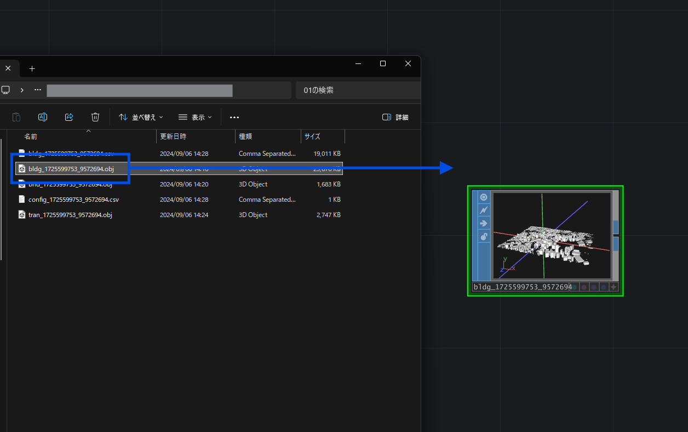
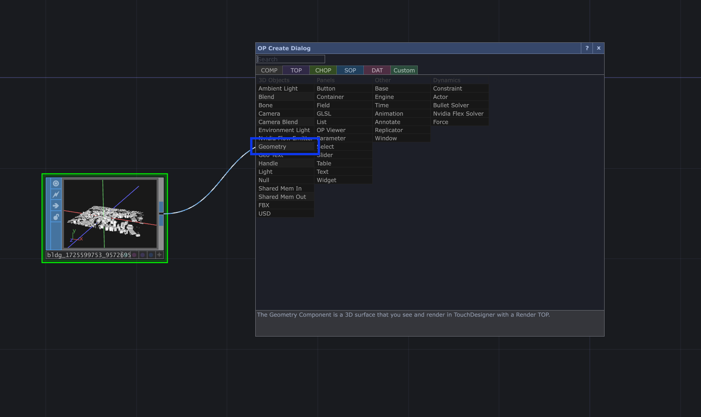
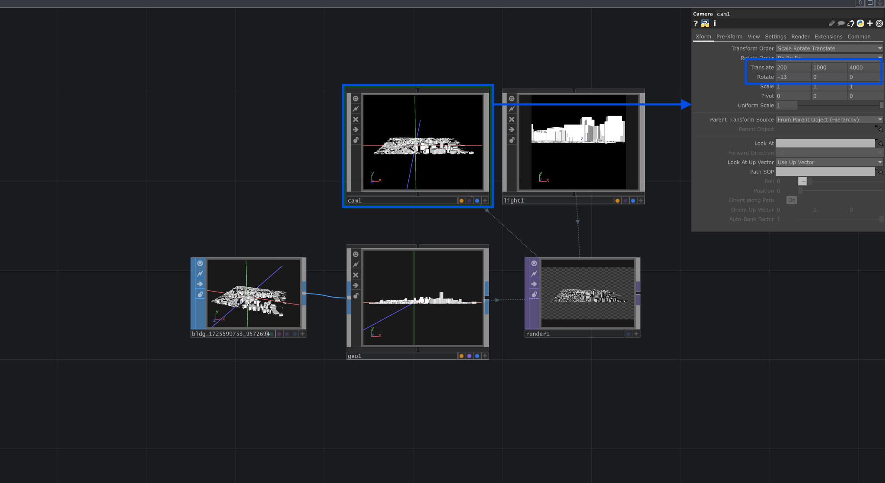
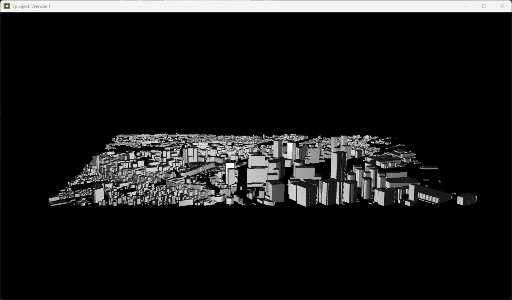

# 書き出したデータのレンダリング

## OBJデータの取り込み

書き出したOBJデータをTouchDesignerのネットワークエディターにドラッグすると、`File in SOP`として読み込まれて利用することができます。

## Geometry COMPの設置

続いて、取り込んだOBJデータをTouchDesigner内でレンダリングする方法を説明します。
まず、取り込んだ`File in SOP`の右側のアウトレット（右端の線が伸びる部分）から線を伸ばしてTagキーを押して、`Geometry COMP`を配置します。

## Camera, Light, Render TOPの設置

`Geometry COMP`が配置できたら、同様にTabキーから`Camera COMP`と`Light COMP`、`Render TOP`を設置します。

そのままだとカメラが全景を捉えていないので、カメラの数値を調整します。オブジェクトが中心にある場合はTranslateのZ位置を3000～5000程度に調整する事で全体が見えるようになります。

以上のステップで書き出したOBJモデルの表示は完了です。

