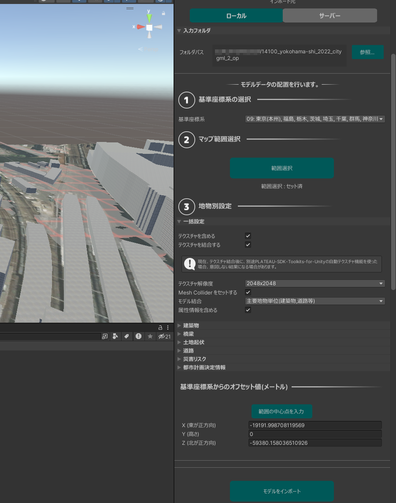
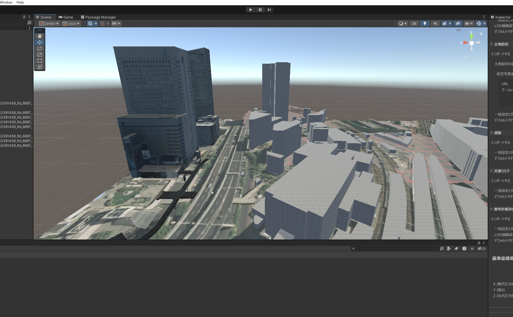
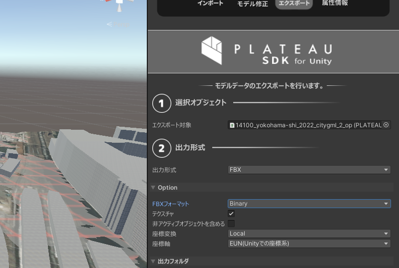
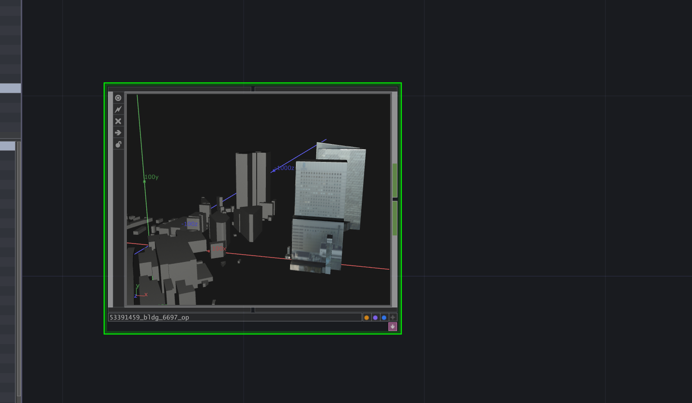

# テクスチャ込みのデータを使うには

本プラグインではテクスチャ込みのモデルデータの生成には現在対応していません。そのため、テクスチャ込みのモデルデータを生成するにはPLATEAU SDK for Unity / Unrealの利用をおすすめしております。以下、[**PLATEAU SDK for Unity**](https://project-plateau.github.io/PLATEAU-SDK-for-Unity/)を使った手順を紹介します。

なお、2022以前のバージョンのTouchDesignerではFBXデータのテクスチャがうまく読み込まれないので、最新版のTouchDesignerにてご利用ください。

まずは上記SDKのマニュアルに沿ってインストールを行います。その後、テクスチャを含めた状態でUnity上でモデルデータを読み込みます。

インポート時の設定

このようにUnityにモデルデータの追加が行えたら、TouchDesignerに持っていくためFBX形式でエクスポートを行います。

その際の設定内容は以下のとおりです。形式をFBXにして、フォーマットはBinaryで、テクスチャのチェックを入れてください。また座標軸についてはUnityと同様の設定を行います。

エクスポート時の設定

書き出されたFBXをTouchDesignerの画面上にドロップすると、このようにテクスチャ込みの状態のFBX COMPとして読み込まれます。

TouchDesignerで生成されたFBXを読み込んだ状態