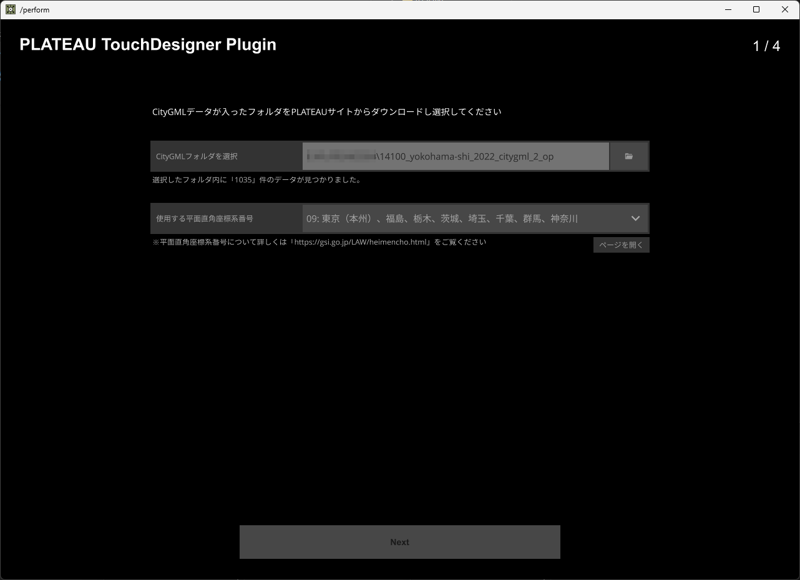
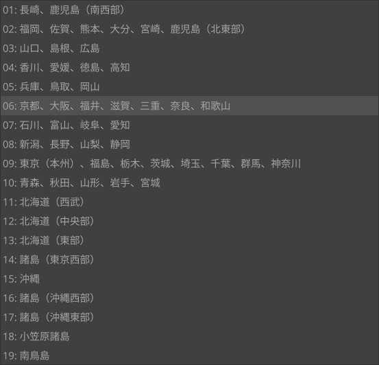
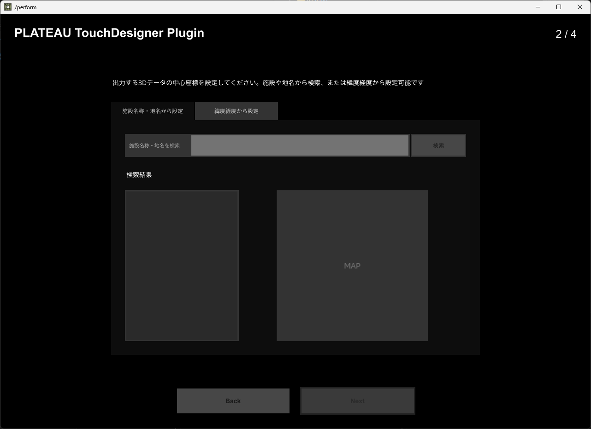
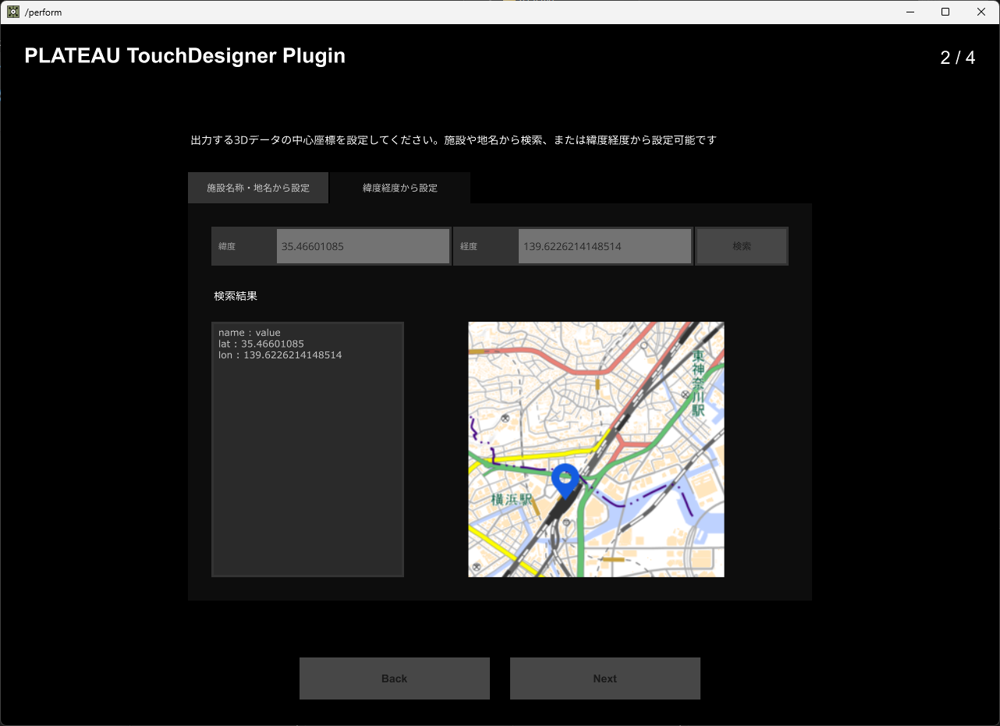
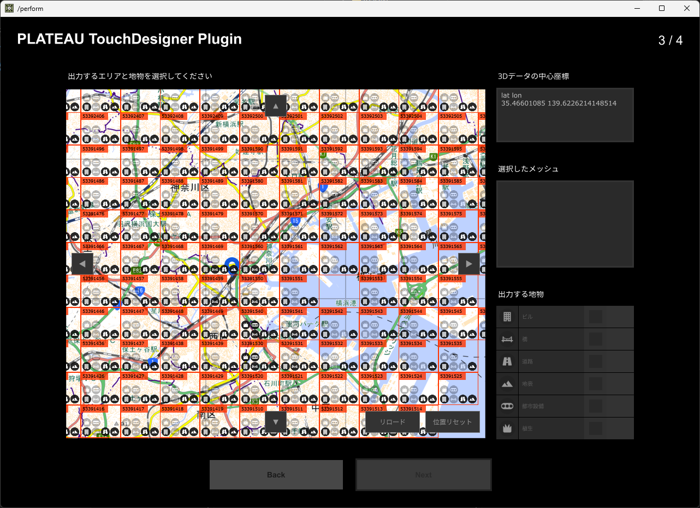
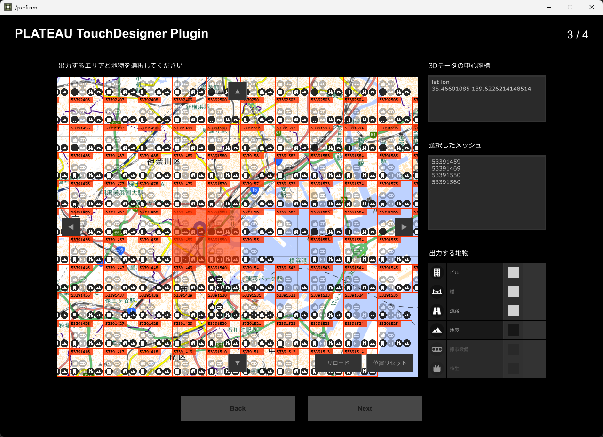
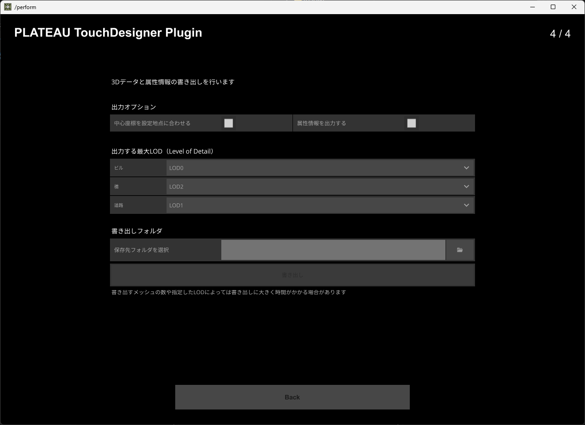
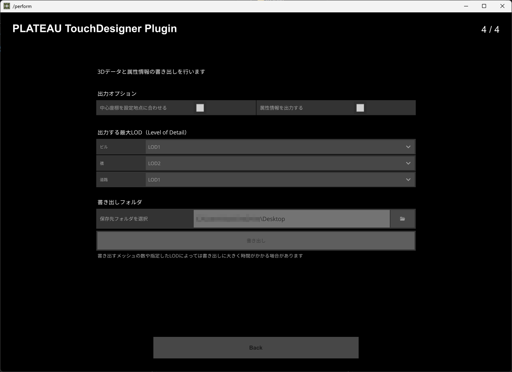
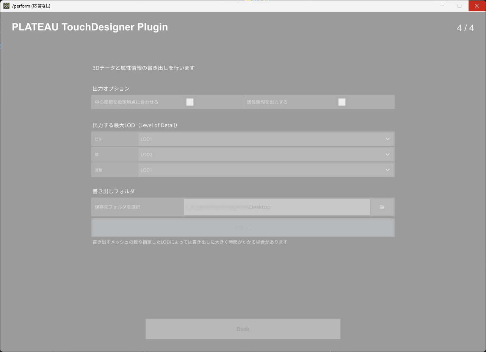

# プラグインの利用方法

1. CityGMLファイルの読み込み
2. 平面直角座標系の設定
3. 出力モデルのセンター位置設定
4. 利用メッシュと地物の選択
5. オプションとLODの選択
6. 書き出し

## CityGMLファイルの読み込み

「PLATEAU-TouchDesigner-Plugin.toe」を開くと、下記のような画面が表示されます。まずは先ほど用意したCityGMLファイルを読み込むため、「CityGMLフォルダを選択」の右にあるフォルダアイコンを選択してください。するとフォルダパスが入力欄に追加されるので、選択した場所と合っていれば次へ進みます。

初期状態

## 平面直角座標系の設定

続いて「使用する平面直角座標系番号」の選択を行います。座標の変換に使用する計算方法が地域によって異なるため、使用するCityGMLファイルの場所にあったものを選択してください。こちらの選択が完了したら「Next」を押して次の画面に進んでください。

フォルダ選択済みの状態

平面直角座標系番号の一覧

## 出力モデルのセンター位置設定

次に、CityGMLファイルをインポートする際の、データの中心座標を指定するための情報を設定します。例えば横浜市のCityGMLファイルを読み込み、中心に横浜駅を設定したい場合は、「施設名称・地名を検索」の欄に「横浜駅」と入力します。すると、横浜駅の位置情報が地図上に表示されます。なお、地図は地理院タイルの1枚分で表示されるため、見つかった地点が端に表示される場合があります。
また、自身で緯度経度を直接設定することも可能です。その場合は上部のタブから「緯度経度から設定」を選択してください。

初期状態

横浜駅の位置を検索した状態

緯度経度を自身で指定した状態

## 利用メッシュと地物の選択

CityGMLファイルが問題なく読み込めると、マップ上にインポート可能な範囲と地物（データにおける分類）のアイコンがメッシュ（※1）毎に表示されます。利用したいエリアを選択（※2）すると、右下に「ビル、橋、道路...」のようにインポート可能な地物が表示されます。この中で利用したいものにチェックを入れて「Next」で次に進みます。

※1 メッシュの区分けについてはこちらのページをご覧ください。
[https://www.mlit.go.jp/plateau/learning/tpc03-1/](https://www.mlit.go.jp/plateau/learning/tpc03-1/)

※2 一度に大量のメッシュを選択すると処理に長い時間がかかる場合があります。まずは少ない数でお試しください。

CityGMLのメッシュが表示されている状態

メッシュを選択後、インポートする地物を選択した状態

## オプションとLODの選択

選択したメッシュと地物からデータを書き出す為の設定を行います。出力オプションの説明は以下をご覧ください。

- 「中心座標を設定地点に合わせる」：「出力モデルのセンター位置設定」で設定した位置に出力モデルの中心を合わせるかどうか
- 「属性情報を出力する」：モデルデータと一緒に属性情報をCSVファイルで出力するかどうか

続いて「出力する最大LOD (Level of Detail)」についてですが、LODとはデータの細かさの度合いを表し、数が大きくなるほど精細なデータになります。書き出しまでの処理時間や3Dデータとして扱う際の処理負荷なども重くなってしまうので、ご自身の利用用途に合わせた数値を設定ください。
TouchDesignerでのビジュアル表現などはLOD2、重い場合はLOD1などをおすすめします。
各地物のLOD毎の形状・属性情報については、3D都市モデル標準製品仕様書に定義しています（[https://www.mlit.go.jp/plateaudocument/](https://www.mlit.go.jp/plateaudocument/)）。必要に応じてご参照ください。

初期状態

保存先フォルダを選択した状態

## 書き出し

設定が完了したら、「保存先フォルダを選択」右にあるフォルダアイコンから、書き出し先を選択してください。処理に時間がかかるのと、処理中はTouchDesignerアプリで他の動作が行えなくなるのでご注意ください。
書き出しが成功すると、選択した場所に3Dデータの「OBJファイル」、属性情報を書き出した場合は「CSVファイル」が生成されます。

書き出し処理中の状態　※（応答なし）と出ますが処理は進行しています